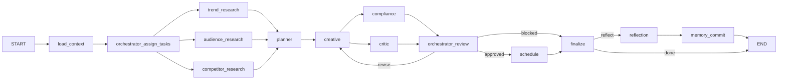

# Multiagent Marketing Engine: Developer Technical Guide

## 1) Purpose
This document explains how the current MVP works end-to-end, including:
- Core LangGraph workflow and control flow.
- Tooling/services used by agents.
- Dynamic task assignment by orchestrator.
- State/data schema used at runtime and storage.
- How completion, skip, error, and revision states are tracked.
- How research agents run in parallel.
- Where core logic lives and what to extend next.

## 2) Core Directory Map
Use this as the shortest path to understand the codebase.

| Area | Purpose | Primary files |
|---|---|---|
| Workflow graph | Node topology, fan-out/fan-in, conditional routing | `src/workflow/graph.py`, `src/workflow/state.py` |
| Agent nodes | Orchestrator routing, specialist agent logic, review loop, finalize/reflection | `src/agents/nodes.py`, `src/agents/prompts.py`, `src/agents/llm_client.py` |
| Services/tools | Analytics read layer, scoring, compliance, web search, image generation, scheduling, memory | `src/services/*.py`, `src/services/__init__.py` |
| Persistence | Repository interface + JSON/Postgres implementations | `src/storage/base.py`, `src/storage/json_store.py`, `src/storage/postgres_store.py` |
| Runtime entrypoints | CLI run path and Streamlit UI run path | `src/run_campaign.py`, `src/frontend_app.py` |
| MCP server | Exposed MCP tools for external workflows | `src/mcp_server.py` |
| Typed data models | Pydantic schema objects for content/scoring/compliance/scheduling | `src/schemas.py` |
| Seed/mock data | Brand/campaign/snapshot/policy/memory/schedule datasets | `data/*.json` |

## 3) System Architecture (Current MVP)
- Execution engine is LangGraph (`StateGraph`) compiled from `src/workflow/graph.py`.
- Agents operate over structured analytics output (already processed upstream) from `analytics_snapshots.json`.
- Tools are injected through `ServiceContainer` (not through MCP client in the workflow runtime).
- Storage backend is pluggable (`json` or `postgres`) selected by `Settings.data_backend`.
- LLM calls are centralized via `LLMClient.run_json()` with mock fallback when `OPENAI_API_KEY` is not set.

## 4) Core Workflow Graph
Graph is built in `build_workflow(runtime)` in `src/workflow/graph.py`.

### Node roles
- `load_context`: Reads brand/campaign/snapshot/memory context.
- `orchestrator_assign_tasks`: Decides which agents should run and mode.
- `trend_research` / `audience_research` / `competitor_research`: Specialist research nodes.
- `planner`: Strategy synthesis.
- `creative`: Asset generation + image generation + ranking.
- `compliance` + `critic`: Parallel quality/policy assessment.
- `orchestrator_review`: Decides `approved` / `revise` / `blocked`.
- `schedule`: Persists selected assets to schedule.
- `finalize`: Produces final output object for campaign or query mode.
- `reflection` + `memory_commit`: Optional post-run learning and memory write.

## 5) Orchestrator Dynamic Task Assignment
Main logic is in `orchestrator_assign_tasks()` (`src/agents/nodes.py`).

### Input to routing
- `request`
- minimal `brand_profile` context
- minimal `campaign_state` context
- `available_agents` list

### Decision path
1. Build deterministic fallback using `_build_task_plan(request)` (keyword heuristics).
2. Ask LLM router with `ORCHESTRATOR_ROUTER_PROMPT`.
3. Normalize/sanitize LLM output with `_normalize_orchestrator_plan(...)`.
4. If parsing/LLM fails, revert to heuristic fallback.
5. Persist:
- `task_plan`
- `assigned_tasks`
- `task_plan_source` (`orchestrator` or `heuristic_fallback`)

### Task plan schema
`task_plan` object keys:
- `mode`: `simple_query | research_planning | campaign_generation`
- `run_trend`
- `run_audience`
- `run_competitor`
- `run_planner`
- `run_creative`
- `run_compliance`
- `run_critic`
- `run_schedule`

### Important normalization rules
- If `run_creative=true`, then planner/compliance/critic/schedule are forced true.
- Invalid mode combinations are corrected based on `run_planner` + `run_creative`.

## 6) How Done vs Not-Done Is Determined
There are 3 layers to understand.

### A) Execution completion in LangGraph
- A node is considered executed when LangGraph runs it and merges its output into state.
- Conditional routes use:
- `route_decision` after review (`revise|approved|blocked`)
- `run_reflection` after finalize (`reflect|done`)

### B) Task enable/disable at node level
- Each specialist node calls `_task_enabled(state, "run_x")`.
- If disabled, node returns structured skip payload, e.g.:
- `{ "trend_report": { "skipped": true, "reason": "..." } }`
- This keeps graph topology stable while enabling dynamic behavior.

### C) UI/trace status projection
- Streamlit status mapping (`pending|running|done|skipped|error`) is computed from streamed node payloads:
- `_status_from_payload(...)`
- `_stream_workflow(... stream_mode="updates")`
- CLI real-time tracing writes node update events to JSONL.

### Practical implication
- The orchestrator does not maintain a separate durable "task ledger" yet.
- Completion is inferred from executed node updates and state keys.
- Skipped tasks are explicit in payloads and UI status map.

## 7) How Research Agents Run in Parallel
Parallelization is enabled by graph shape, not a custom thread config.

### Fan-out
- `orchestrator_assign_tasks -> trend_research`
- `orchestrator_assign_tasks -> audience_research`
- `orchestrator_assign_tasks -> competitor_research`

These three nodes are independent siblings in the same frontier and can run concurrently.

### Fan-in
- Each research node has an edge into `planner`.
- `planner` waits for all upstream research branches to complete in graph semantics.

### Dynamic skip still preserves fan-in
- If a research task is disabled, that node returns quickly with `skipped=true`.
- This still satisfies the branch for planner fan-in.

## 8) Tools and Services Used
Service wiring is in `src/services/__init__.py` (`build_services`).

### Services used by workflow nodes
- `AnalyticsService`: Reads snapshot slices (`trend_signals`, `topic_clusters`, etc).
- `WebSearchService`: Tavily/SerpAPI or mock fallback.
- `ScoringService`: Predictive ranking for creative assets.
- `ComplianceService`: Rule-based pre-score + LLM summary.
- `NanoBananaClient`: Gemini image generation with optional subject-image inputs.
- `SchedulingService`: Writes scheduled posts to repository.
- `MemoryService`: Read/update scoped memory (`shared`, `planner`, `creative`).

### MCP server tool surface
- `src/mcp_server.py` exposes analytics/search/scoring/compliance/scheduling/memory tools.
- Current workflow runtime does **not** call MCP over transport; it uses local services directly.
- MCP is reusable by external workflows/clients.

## 9) Runtime Schema and Data Shapes

### A) Workflow runtime state schema
Defined in `src/workflow/state.py` (`WorkflowState` `TypedDict`).

Key state groups:
- Request/context: `request`, `brand_id`, `campaign_id`, `run_reflection`, `include_campaign_state_in_planner`.
- Routing: `task_plan`, `assigned_tasks`, `task_plan_source`, `status`, `revision_count`.
- Context payloads: `brand_profile`, `campaign_state`, `analytics_snapshot`, memory scopes.
- Agent outputs: `trend_report`, `audience_report`, `competitor_report`, `planner_output`, `creative_assets`, `compliance_result`, `critic_result`.
- Review/scheduling: `route_decision`, `approved_assets`, `scheduled_posts`, `orchestrator_summary`.
- Reflection: `reflection_report`, `memory_update_result`.
- Finalization: `final_output`.

### B) Domain Pydantic models
`src/schemas.py` includes:
- `TopicCluster`, `VisualCluster`, `EntityTrend`, `CommentSignal`, `CompetitorPost`, `SegmentMetric`.
- `CandidateAsset`, `ScoredCandidate`, `ComplianceResult`, `ScheduledPost`.

### C) Repository contract
`DataRepository` (`src/storage/base.py`) defines required methods:
- `get_brand_profile`
- `get_campaign_state`
- `write_campaign_state`
- `get_analytics_snapshot`
- `get_policy_rules`
- `get_memory`
- `update_memory`
- `append_schedule`

### D) JSON backend data files (current MVP)
- `data/brand_profiles.json`: brand metadata and voice/guidelines.
- `data/campaign_states.json`: campaign objective, channels, KPI targets, status, scheduled posts.
- `data/analytics_snapshots.json`: structured analytics snapshot used by agents.
- `data/policy_rules.json`: banned claims, required disclosures, platform rules.
- `data/memories.json`: scoped lessons.
- `data/schedule.json`: scheduled post records by campaign.

### E) Postgres backend tables
Defined in `src/storage/postgres_store.py`:
- `brand_profiles`
- `campaign_states`
- `analytics_snapshots`
- `policy_rules`
- `memories`
- `scheduled_posts`

## 10) Entrypoints, Runtime, and Observability

### CLI
`src/run_campaign.py`
- `graph.invoke(...)` for one-shot.
- `graph.stream(..., stream_mode="updates")` for real-time.
- Optional `--trace-file` JSONL traces.

### Frontend
`src/frontend_app.py`
- Cached graph/runtime loading via `@st.cache_resource` (`_load_runtime_graph`).
- Real-time panel uses streamed updates to render node statuses and event feed.
- Run history persisted to `logs/campaign_runs.jsonl`.
- Optional trace file defaults to `logs/workflow_trace_ui.jsonl`.

## 11) Current Extension Points
- Routing behavior: `src/agents/prompts.py` + `orchestrator_assign_tasks`.
- Agent business logic: `src/agents/nodes.py`.
- Tool/provider behavior: `src/services/*.py`.
- Storage backend integration: `src/storage/factory.py` + repository implementations.
- UI status/trace: `src/frontend_app.py`.
- MCP tool surface: `src/mcp_server.py`.

## 12) Future Implementations (Recommended)
1. Add durable task execution ledger.
- Persist node start/end/error timestamps and retries.
- Store per-node run IDs for replay/debugging.

2. Replace heuristic fallback with strongly typed router output validation.
- Validate against explicit schema before accepting LLM plan.
- Add confidence + rationale quality checks.

3. Move workflow tool access to MCP client path (optional architecture).
- Keep local services as fallback.
- Enable remote tool providers without changing node code.

4. Add deeper parallel branch controls.
- Explicit timeouts/retries per branch.
- Circuit breakers for unreliable providers.

5. Improve web research quality controls.
- Recency filters, source allowlists, dedupe, and provenance scoring.
- Persist cited URLs in final output by default.

6. Strengthen schema contracts.
- Introduce Pydantic output models per agent.
- Fail-fast or auto-repair with explicit audit flags.

7. Add test coverage for graph routing semantics.
- Unit tests for router normalization and skip behavior.
- Integration tests for revise loop and conditional edges.

8. Add production-ready observability.
- Structured logs with correlation IDs.
- Metrics for per-node latency, error rate, and skip ratio.
